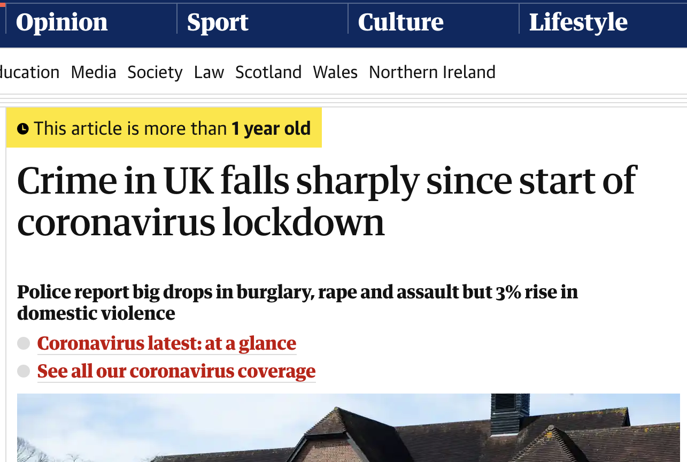

class: center, middle

# Aim

Explore changes in calls for service and response over the pandemic and associated lockdowns. 

```{r setup, include=FALSE}
knitr::opts_chunk$set(cache = TRUE, echo = FALSE, include = TRUE, 
                      message = FALSE, warning = FALSE)

library(lubridate)
library(tidyverse)
library(tsibble)
library(sf)
library(ineq)

```

```{r load-data, include=FALSE}
all_calls <- read_rds("/Volumes/n8_covid/all_calls_forecast.Rds")
call_forecasts <- read_rds("/Volumes/n8_covid/call_forecasts.Rds")
all_rt_forecast <- read_rds("/Volumes/n8_covid/all_resp_time_forecast.Rds")
by_type_rt_forecast <- read_rds("/Volumes/n8_covid/by_type_rt_forecasts.Rds")
by_grade_rt_forecast <- read_rds("/Volumes/n8_covid/by_grade_rt_forecasts.Rds")
all_calls_attended_forecast <- read_rds("/Volumes/n8_covid/all_attended_forecasts.Rds")
by_type_attended_forecast <- read_rds("/Volumes/n8_covid/by_type_attended_forecasts.Rds")
attended_by_grade_forecast <- read_rds("/Volumes/n8_covid/attended_by_grade_forecasts.Rds")
domestic_by_grade_volume_forecasts <- read_rds("/Volumes/n8_covid/domestic_by_grade_volume_forecasts.Rds")
domestic_by_grade_rt_forecast <- read_rds("/Volumes/n8_covid/domestic_by_grade_rt_forecasts.Rds")
domestic_by_grade_attended_forecasts <- read_rds("/Volumes/n8_covid/domestic_by_grade_attended_forecasts.Rds")
by_grade_tos_forecasts <- read_rds("/Volumes/n8_covid/by_grade_tos_forecasts.Rds")
cheshire_lsoas <- st_read("../cheshire_lsoas.geojson")
lsoa_filler <- bind_rows(data.frame(lsoa = unique(cheshire_lsoas$LSOA11NM),
                          pre_post = "Pre-COVID"), 
                         data.frame(lsoa = unique(cheshire_lsoas$LSOA11NM),
                          pre_post = "2020"))
total_calls_by_imd <- read_csv("/Volumes/n8_covid/total_calls_by_imd.csv")
weekly_count_by_lsoa <- read_csv("/Volumes/n8_covid/weekly_count_by_lsoa.csv")
weekly_asb_by_lsoa <- read_csv("/Volumes/n8_covid/weekly_asb_by_lsoa.csv")
# gini_asb <- read_rds("/Volumes/n8_covid/gini_asb_forecast.Rds")


# Note important dates
# Source: https://www.instituteforgovernment.org.uk/sites/default/files/timeline-lockdown-web.pdf
dates <- tribble(
  ~date, ~event,
  "2020-01-31", "first UK COVID case",
  "2020-03-23", "first lockdown begins",
  "2020-06-15", "first lockdown ends",
  "2020-11-05", "second lockdown begins",
  "2020-12-02", "second lockdown ends"
) %>% 
  mutate(
    date = as_date(yearweek(ymd(date))), 
    row = row_number(),
    label = str_glue("{row}. {event}")
  )

forecast_chart <- function (forecasts, variable, value) {
  

  # get forecast type to string
  df_name <- deparse(substitute(forecasts))
  
  # conditionally label y axis
  y_axis_label <- case_when(df_name %in% c("by_type_rt_forecast", 
                                           "by_grade_rt_forecast", 
                                           "domestic_by_grade_rt_forecast") ~ "Median response time (in minutes)", 
                         df_name %in% c("call_forecasts", 
                                        "domestic_by_grade_volume_forecasts") ~ "Weekly count of calls for service", 
                         df_name %in% c("by_type_attended_forecast",
                                        "attended_by_grade_forecast", 
                                        "domestic_by_grade_attended_forecasts") ~ "Weekly % of calls attended", 
                         df_name %in% c("by_grade_tos_forecasts") ~ "Median time on scene (in minutes)")
  
  
  # conditionally find actual value column
  actual_col_name <- case_when(df_name %in% c("by_type_rt_forecast", 
                                           "by_grade_rt_forecast",
                                           "domestic_by_grade_rt_forecast") ~ "actual_rt", 
                         df_name %in% c("call_forecasts",
                                        "domestic_by_grade_volume_forecasts") ~ "actual_calls", 
                         df_name %in% c("by_type_attended_forecast",
                                        "attended_by_grade_forecast", 
                                        "domestic_by_grade_attended_forecasts") ~ "actual_attended", 
                         df_name %in% c("by_grade_tos_forecasts") ~ "actual_tos")
  
  forecasts %>% 
    filter(eval(as.symbol(variable)) %in% value) %>% 
    # Occasionally the ARIMA model may produce forecast confidence intervals
    # that are less than zero, which will not show up on the plot because we
    # have set the y axis to start at zero (to make changes in vertical position
    # on the axis representative of changes in magnitude). To deal with this we
    # will manually set the lower CI of the forecasts to be zero if it is less
    # than zero in the original forecast.
    mutate(forecast_lower = ifelse(forecast_lower < 0, 0, forecast_lower)) %>% 
    ggplot() +
    # Forecast
    geom_ribbon(
      aes(incident_week, ymin = forecast_lower, ymax = forecast_upper), 
      na.rm = TRUE,
      alpha = 0.5, 
      fill = "grey80"
    ) +
    geom_line(aes(incident_week, forecast_mean), na.rm = TRUE, linetype = "22") +
    # Dates of interest
    geom_vline(aes(xintercept = date), data = dates, linetype = "12") +
    geom_label(aes(date, 0, label = row), data = dates, colour = "grey20") +
    # Actual calls
    geom_line(aes(incident_week, eval(as.symbol(actual_col_name)))) +
    geom_point(aes(incident_week, eval(as.symbol(actual_col_name)), fill = sig), shape = 21) +
    scale_x_date(date_labels = "%e %b\n%Y", 
                 limits = as.Date(c("2020-01-06", "2020-12-21")))+
    scale_y_continuous(limits = c(0, NA), labels = scales::comma_format()) +
    scale_fill_manual(values = c(`TRUE` = "black", `FALSE` = "grey80")) +
    labs(
      title = value,
      subtitle = "",
      caption = "Forecast calculated using data up to 31 January 2020",
      x = NULL,
      y = y_axis_label,
      fill = "Actual observed value significantly different from forecast"
    ) +
    theme_minimal() +
    theme(legend.position = "bottom", plot.title = element_text(face = "bold"))
  
}


```

---
class: center, middle

# The problem

Binary comparisons of one period to another are common, but can be seriously misleading.

---

class: center, middle

<table>
  <tr>
    <td></td>
    <td></td>
  </tr>
  <tr style="background-color: #FFFFFF;">
    <td></td>
    <td></td>
  </tr>
</table>


---

# It's easy to miss the big picture

```{r atlanta-map-prep, include=FALSE}
tidy_data <- read_csv("imgs/tracking-crime-changes-data.rds") %>% 
  filter(offense_type == "HOMICIDE") %>% 
  mutate(year = year(offense_date)) %>% 
  count(year, wt = n) %>% 
  filter(year %in% 2016:2017) %>% 
  mutate(
    change = (n - lag(n)) / lag(n),
    hjust = ifelse(year == 2016, 1, 0),
    label = ifelse(
      hjust == 0, 
      str_glue("{n} homicides\n({scales::percent(change)})"), 
      str_glue("{n} homicides")
    )
  )

example_homicides <- read_rds("imgs/atlanta_example_homicides.Rds")
```

```{r atlanta-map-1, fig.asp=0.56, fig.retina=4, out.width="100%"}
# Create an empty map with necessary scales, theme, etc. (geoms will be added
# later)
atlanta_map <- ggplot(tidy_data, aes(year, n)) +
  scale_x_continuous(
    breaks = 2016:2017, 
    limits = c(2010, 2018),
    labels = scales::number_format(accuracy = 1, big.mark = ""),
    expand = expansion(mult = c(0.025, 0.1))
  ) +
  scale_y_continuous(
    limits = c(0, 150), 
    expand = expansion(mult = c(0, 0.03))
  ) +
  labs(
    x = NULL,
    y = "annual count of homicides",
    caption = "Data: Atlanta Police Department"
  ) +
  theme_minimal() +
  theme(panel.grid.minor.x = element_blank())

atlanta_map +
  geom_line(na.rm = TRUE, colour = "#EA7600", size = 1) +
  geom_point(na.rm = TRUE, colour = "#EA7600") +
  geom_label(
    aes(hjust = hjust, label = label), 
    fill = NA, 
    label.padding = unit(0.5, "lines"), 
    label.size = NA,
    lineheight = 1.05
  )
```

---

# It's easy to miss the big picture

```{r atlanta-map-2, fig.asp=0.56, fig.retina=4, out.width="100%"}
trend_type <- "part of a downward trend"

atlanta_map +
	geom_line(
	  data = filter(example_homicides, scenario == trend_type), 
	  na.rm = TRUE,
	  colour = "grey80", 
	  size = 1
	) +
	geom_point(
	  data = filter(example_homicides, scenario == trend_type), 
	  na.rm = TRUE,
	  colour = "grey80"
	) +
  geom_line(na.rm = TRUE, colour = "#EA7600", size = 1) +
  geom_point(na.rm = TRUE, colour = "#EA7600") +
  annotate(
    "label", 
    label = trend_type,
    x = 2010.5, 
    y = 10, 
    fill = "orange", 
    fontface = "bold",
    hjust = 0, 
    label.size = NA, 
    label.padding = unit(0.5, "lines"), 
    size = 5,
    vjust = 0
  )
```

---

# It's easy to miss the big picture

```{r atlanta-map-3, fig.asp=0.56, fig.retina=4, out.width="100%"}
trend_type <- "a one-year blip with no trend"

atlanta_map +
	geom_line(
	  data = filter(example_homicides, scenario == trend_type), 
	  na.rm = TRUE,
	  colour = "grey80", 
	  size = 1
	) +
	geom_point(
	  data = filter(example_homicides, scenario == trend_type), 
	  na.rm = TRUE,
	  colour = "grey80"
	) +
  geom_line(na.rm = TRUE, colour = "#EA7600", size = 1) +
  geom_point(na.rm = TRUE, colour = "#EA7600") +
  annotate(
    "label", 
    label = trend_type,
    x = 2010.5, 
    y = 10, 
    fill = "orange", 
    fontface = "bold",
    hjust = 0, 
    label.size = NA, 
    label.padding = unit(0.5, "lines"), 
    size = 5,
    vjust = 0
  )
```

---

# It's easy to miss the big picture

```{r atlanta-map-4, fig.asp=0.56, fig.retina=4, out.width="100%"}
trend_type <- "a one-year blip in an upward trend"

atlanta_map +
	geom_line(
	  data = filter(example_homicides, scenario == trend_type), 
	  na.rm = TRUE,
	  colour = "grey80", 
	  size = 1
	) +
	geom_point(
	  data = filter(example_homicides, scenario == trend_type), 
	  na.rm = TRUE,
	  colour = "grey80"
	) +
  geom_line(na.rm = TRUE, colour = "#EA7600", size = 1) +
  geom_point(na.rm = TRUE, colour = "#EA7600") +
  annotate(
    "label", 
    label = trend_type,
    x = 2010.5, 
    y = 10, 
    fill = "orange", 
    fontface = "bold",
    hjust = 0, 
    label.size = NA, 
    label.padding = unit(0.5, "lines"), 
    size = 5,
    vjust = 0
  )
```

---

# It's easy to miss the big picture

```{r atlanta-map-5, fig.asp=0.56, fig.retina=4, out.width="100%"}
trend_type <- "random variation with no trend"

atlanta_map +
	geom_line(
	  data = filter(example_homicides, scenario == trend_type), 
	  na.rm = TRUE,
	  colour = "grey80", 
	  size = 1
	) +
	geom_point(
	  data = filter(example_homicides, scenario == trend_type), 
	  na.rm = TRUE,
	  colour = "grey80"
	) +
  geom_line(na.rm = TRUE, colour = "#EA7600", size = 1) +
  geom_point(na.rm = TRUE, colour = "#EA7600") +
  annotate(
    "label", 
    label = trend_type,
    x = 2010.5, 
    y = 10, 
    fill = "orange", 
    fontface = "bold",
    hjust = 0, 
    label.size = NA, 
    label.padding = unit(0.5, "lines"), 
    size = 5,
    vjust = 0
  )
```

---

# Need to account for trends
.center[]

---

# Need to account for noise
.center[]

---

# Another way to understand change

```{r cin-chart-prep, include=FALSE}
# Load data from Cincinnati for ARIMA example chart
cin_calls <- read_rds("imgs/cin_calls.Rds")
cin_model <- read_rds("imgs/cin_model.Rds")
cin_forecast <- read_rds("imgs/cin_forecast.Rds")

# Build a basic chart that we can build on later
cin_chart <- cin_calls %>% 
  filter(week <= ymd("2020-01-20")) %>% 
  ggplot(aes(week, calls)) +
  scale_x_date(
    date_breaks = "6 months", 
    date_labels = "%b\n%Y", 
    limits = c(ymd("2016-01-01"), ymd("2020-09-30")),
    expand = expansion(mult = c(0.02, 0))
  ) +
  scale_y_continuous(
    limits = c(0, 11000), 
    labels = scales::comma_format(accuracy = 1, scale = 1/1000, suffix = "k"),
    expand = expansion(mult = c(0, 0.05))
  ) +
    scale_fill_manual(
      values = c(`FALSE` = "grey90", `TRUE` = "black"),
      labels = c(
        `FALSE` = "calls within 99% CI",
        `TRUE` = "calls outside 99% CI"
      )
    ) +
  labs(
    fill = NULL,
    x = NULL,
    y = "total calls per week, Cincinnati"
  ) +
  theme_minimal() +
  theme(
    legend.background = element_rect(colour = NA, fill = "white"),
    legend.justification = c(1, 0),
    legend.position = c(1, 0.05),
    panel.grid.major.x = element_blank(),
    panel.grid.minor.x = element_blank()
  )
```

```{r cin-chart-1, fig.asp=0.56, fig.retina=4, out.width="100%"}
# Print the basic chart (this needs to be in a seprate chunk because the 
# `cin-chart-prep` chunk needs `include=FALSE`)
cin_chart
```

---

# Another way to understand change

```{r cin-chart-2, fig.asp=0.56, fig.retina=4, out.width="100%"}
cin_chart <- cin_chart + 
  # print points showing actual counts before COVID
  geom_point(size = 0.75, colour = "grey67")

cin_chart +
  annotate(
    "label", 
    label = "1. count calls",
    x = ymd("2016-03-01"), 
    y = 1000, 
    fill = "orange", 
    fontface = "bold", 
    hjust = 0, 
    label.size = NA, 
    label.padding = unit(0.5, "lines"), 
    vjust = 0
  )
```

---

# Another way to understand change

```{r cin-chart-3, fig.asp=0.56, fig.retina=4, out.width="100%"}
cin_chart <- cin_chart + 
  # print line showing model fitted counts
  geom_line(aes(week, .fitted), data = cin_model)

cin_chart + 
  annotate(
    "label", 
    label = "2. estimate auto-ARIMA model",
    x = ymd("2016-03-01"), 
    y = 1000, 
    fill = "orange", 
    fontface = "bold", 
    hjust = 0, 
    label.size = NA, 
    label.padding = unit(0.5, "lines"), 
    vjust = 0
  )
```

---

# Another way to understand change

```{r cin-chart-4, fig.asp=0.56, fig.retina=4, out.width="100%"}
cin_chart <- cin_chart + 
  geom_vline(
    aes(xintercept = ymd("2020-01-20")), 
    size = 0.25, 
    colour = "grey50"
  ) +
  # print line showing CI around estimate
  geom_ribbon(
    aes(x = week, ymin = lower, ymax = upper), 
    data = cin_forecast,
    na.rm = TRUE,
    inherit.aes = FALSE,
    fill = "grey90"
  ) +
  # print line showing estimate of crimes
  geom_line(
    aes(week, estimate), 
    data = cin_forecast, 
    na.rm = TRUE, 
    colour = "grey60",
    linetype = "32"
  )

cin_chart + 
  annotate(
    "label", 
    label = "3. forecast from model (with 99% CIs)",
    x = ymd("2016-03-01"), 
    y = 1000, 
    fill = "orange", 
    fontface = "bold", 
    hjust = 0, 
    label.size = NA, 
    label.padding = unit(0.5, "lines"), 
    vjust = 0
  )
```

---

# ARIMA models: a better way to understand change

```{r cin-chart-5, fig.asp=0.56, fig.retina=4, out.width="100%"}
cin_chart + 
  # print line showing count of crimes
  geom_line(
    aes(x = week, y = calls), 
    data = filter(cin_forecast, week >= ymd("2020-01-20")), 
    na.rm = TRUE, 
    colour = "black"
  ) +
  # print points showing actual counts after COVID
  geom_point(
    aes(week, calls, fill = sig), 
    data = filter(cin_forecast, week >= ymd("2020-01-20")), 
    na.rm = TRUE,
    # size = 0.75, 
    colour = "black",
    shape = 21
  ) + 
  annotate(
    "label", 
    label = "4. compare counts to forecast",
    x = ymd("2016-03-01"), 
    y = 1000, 
    fill = "orange", 
    fontface = "bold", 
    hjust = 0, 
    label.size = NA, 
    label.padding = unit(0.5, "lines"), 
    vjust = 0
  )
```

---
class: center, middle, inverse

# Results

---

```{r totalcallsfig, fig.width=11,fig.height=7}

# Total calls fig
all_calls %>% 
 mutate(forecast_lower = ifelse(forecast_lower < 0, 0, forecast_lower)) %>% 
  ggplot() +
  # Forecast
  geom_ribbon(
    aes(incident_week, ymin = forecast_lower, ymax = forecast_upper), 
    na.rm = TRUE,
    alpha = 0.5, 
    fill = "grey80"
  ) +
  geom_line(aes(incident_week, forecast_mean), na.rm = TRUE, linetype = "22") +
  # Dates of interest
  geom_vline(aes(xintercept = date), data = dates, linetype = "12") +
  geom_label(aes(date, 0, label = row), data = dates, colour = "grey20") +
  # Actual calls
  geom_line(aes(incident_week, actual_calls)) +
  geom_point(aes(incident_week, actual_calls, fill = sig), shape = 21) +
  scale_x_date(date_labels = "%e %b\n%Y", 
               limits = as.Date(c("2020-01-06", "2020-12-21"))) +
  scale_y_continuous(limits = c(0, NA), labels = scales::comma_format()) +
  scale_fill_manual(values = c(`TRUE` = "black", `FALSE` = "grey80")) +
  labs(
    title = "Change in all calls for service during 2020 \ncompared to pre-pandemic forecast",
    subtitle = str_wrap(
      str_glue("Events by week: ", str_c(pull(dates, label), collapse = "; ")), 
      80
    ),
    caption = "Forecast calculated using data up to 31 January 2020",
    x = NULL,
    y = "Weekly number of calls",
    fill = "actual calls significantly different from forecast"
  ) +
  theme_minimal() +
  theme(legend.position = "bottom", 
        plot.title = element_text(face = "bold"), 
        text = element_text(size = 20)) +
  xlim(c(min(all_calls$incident_week), ymd("2020-12-14")))

```


---
class: center, middle, inverse

# Changes in call types


---

# Quiet roads

```{r quietroadsplots, fig.width=11,fig.height=8}


p1 <- forecast_chart(call_forecasts, "incident_type_new" ,"traffic collision") + 
  labs(title = "Traffic Collision",
      subtitle = "",
      caption = "",
      x = NULL,
      y = NULL,
      fill = NULL) + 
  guides(fill="none")
p2 <- forecast_chart(call_forecasts, "incident_type_new" ,"Highway Disruption")+ 
  labs(subtitle = "", caption = "", x = NULL, fill = NULL) + 
  guides(fill="none")
p3 <- forecast_chart(call_forecasts, "incident_type_new" ,"Road Related Traffic Offence")  +
  labs(subtitle = "",
      caption = "Forecast calculated using data up to 31 January 2020",
      x = NULL,
      y = NULL,
      fill = "Actual observed value significantly different from forecast")

gridExtra::grid.arrange(p1, p2, p3, ncol = 1)


```


---

# Expressions of concern


```{r asbplot, fig.width=11,fig.height=8}

p1 <- forecast_chart(call_forecasts, "incident_type_new", "ASB") + 
  labs(subtitle = "",
      caption = "",
      x = NULL,
      y = NULL,
      fill = NULL) + 
  guides(fill="none")
# p2 <- forecast_chart(call_forecasts, "incident_type_new", "Drugs")
# 
# gridExtra::grid.arrange(p1, p2, ncol = 1)

p1


```

---

# Expressions of concern

> "ASB calls [are] about COVID breaches being coded as ASB … lots of people were reporting other people for breaching the rules. There were a lot of calls where people were very frustrated and they were complaining about their neighbours and the sort of call that sticks in my mind, which I found quite moving quite upsetting really was when somebody would ring in and say that they weren't able to go and visit their elderly relative who lived maybe a mile away … and their next door neighbour was having a party and all these people were turning up." (interview 1)

---

## Advice/Directions/Admin

```{r Admin, fig.width=11,fig.height=8}

forecast_chart(call_forecasts, "incident_type_new", "Advice/Directions/Admin")
```


---

# Calls for information

> "… there are also people calling in because they wanted advice about regulations or were uncertain about what they were allowed to do …" (interview 3)

---

# Calls for reassurance

> "I'd say there's definitely an increase in mental health related incidents that we're seeing and I think people are just really struggling with the isolation of being away from everyone … Sometimes people don't know [who to call] to speak to someone for support so they just ring the police. " (interview 4)

---

# Support for such calls - internal FAQ

> "We have an FAQ. That specially for FCC staff. And most of the answers can be found in there … There was plenty of support here at work … we had a very large VDU display on the wall with the latest rules and regulations like a like a PowerPoint running through on a continual rotation." (interview 1) 


---

# Violence and harassment

```{r Violence/Harassment, fig.width=11,fig.height=7}
forecast_chart(call_forecasts, "incident_type_new", "Violence/Harassment")
```

---

# Night time economy

> "A lot of the violence incidents that we deal with, especially the likes of Friday night, Saturday night, weekends people have been out drinking and the clubs and pubs and starting fights wasn't happening because the pubs weren't open." (interview 8)

---

# Online harassment

> "So obviously people are not able to go out and interact in person, but they can over social media and other avenues, such as phone calls, texts - these definitely seem more … I'd say they changed in the sense that the threats were still being made, but not in person, so they will be made over a text or a phone call, social media …" (interview 4)


---

# Domestic incidents

```{r domesticfig, fig.width=11,fig.height=7}

# domestic fig
forecast_chart(call_forecasts, "incident_type_new", "Domestic Incident")


```


---


# Domestic incidents: no increase

> "We were expecting an increase in domestic violence and domestic violence is a big issue for any force. And I'm not sure that in the early days we saw an increase. Certainly I didn't notice a dramatic increase or anything like that. (interview 3)

> "I did expect more domestics and things because people were in their addresses, but it didn't. From my personal experience didn't seem to happen." (interview 7)

---

# Domestic incidents linked with NTE

> "… when we get the calls it's like … when they've been out on the town up to the pubs having drinks and then they come back and they disagree over something so little. And that's when the domestic start." (interview 5)

---

# Domestic incidents: couldn't call?

> "I remember a lady who was desperately upset. She was very, very distressed and this must have been as lockdown was easing a bit because her husband had actually gone out and this was the first opportunity she'd had to make the call … " (interview 1)

---

# Presence of guardians/ absence of targets


```{r guardiansplot1, fig.width=11,fig.height=8}

forecast_chart(call_forecasts, "incident_type_new", "Burglary - Residential") 

```

---

# Presence of guardians/ absence of targets


```{r guardiansplot2, fig.width=11,fig.height=7}


p1 <- forecast_chart(call_forecasts, "incident_type_new", "Theft From Motor Vehicle") + 
  labs(subtitle = "", caption = "", x = NULL, y = NULL, fill = NULL) + 
  guides(fill="none")
p2 <- forecast_chart(call_forecasts, "incident_type_new", "Theft Of Motor Vehicle") + 
  labs(subtitle = "", caption = "", x = NULL, y = NULL, fill = NULL) + 
  guides(fill="none")
p3 <- forecast_chart(call_forecasts, "incident_type_new", "Theft Other")

gridExtra::grid.arrange(p1, p2,p3, ncol = 1)

```

---

# Presence of guardians/ absence of targets


```{r guardiansplot3, fig.width=11,fig.height=7}


p1 <- forecast_chart(call_forecasts, "incident_type_new", "Shoplifting") + 
  labs(subtitle = "", caption = "", x = NULL, y = NULL, fill = NULL) + 
  guides(fill="none")
p2 <- forecast_chart(call_forecasts, "incident_type_new", "Robbery") 

gridExtra::grid.arrange(p1, p2, ncol = 1)

```
---

# Police response: Attendance rate


```{r allattendedfig, fig.width=11,fig.height=7}

# % attended fig and response time fig
all_calls_attended_forecast %>% 
    mutate(forecast_lower = ifelse(forecast_lower < 0, 0, forecast_lower)) %>% 
    ggplot() +
    # Forecast
    geom_ribbon(
      aes(incident_week, ymin = forecast_lower, ymax = forecast_upper), 
      na.rm = TRUE,
      alpha = 0.5, 
      fill = "grey80"
    ) +
    geom_line(aes(incident_week, forecast_mean), na.rm = TRUE, linetype = "22") +
    # Dates of interest
    geom_vline(aes(xintercept = date), data = dates, linetype = "12") +
    geom_label(aes(date, 0, label = row), data = dates, colour = "grey20") +
    # Actual calls
    geom_line(aes(incident_week, actual_attended)) +
    geom_point(aes(incident_week, actual_attended, fill = sig), shape = 21) +
    scale_x_date(date_labels = "%e %b\n%Y", 
               limits = as.Date(c("2020-01-06", "2020-12-21"))) +
    scale_y_continuous(limits = c(0, NA), labels = scales::comma_format()) +
    scale_fill_manual(values = c(`TRUE` = "black", `FALSE` = "grey80")) +
    labs(
      title = "Attendance rate for all calls for service during 2020 compared to pre-pandemic forecast",
      subtitle = str_wrap(
        str_glue("Events by week: ", str_c(pull(dates, label), collapse = "; ")), 
        80
      ),
      caption = "Forecast calculated using data up to 31 January 2020",
      x = NULL,
      y = "weekly % of calls attended",
      fill = "actual % significantly different from forecast"
    ) +
    theme_minimal() +
    theme(legend.position = "bottom", plot.title = element_text(face = "bold"))
  


```

---

# Police response: Attendance rate

```{r bygradeattendedperc, fig.width=11,fig.height=7}

p1 <- forecast_chart(attended_by_grade_forecast,"initial_grade_of_response", "Grade 1") + 
  labs(subtitle = "", caption = "", x = NULL, fill = NULL) + 
  guides(fill="none")
p2 <- forecast_chart(attended_by_grade_forecast,"initial_grade_of_response", "Grade 2") + 
  labs(subtitle = "", caption = "", x = NULL, y = NULL, fill = NULL) + 
  guides(fill="none")
p3 <- forecast_chart(attended_by_grade_forecast,"initial_grade_of_response", "Grade 3") + 
  labs(subtitle = "", caption = "", x = NULL, y = NULL, fill = NULL) + 
  guides(fill="none")
p4 <- forecast_chart(attended_by_grade_forecast,"initial_grade_of_response", "Grade 4") + 
  labs(subtitle = "", caption = "", x = NULL, y = NULL, fill = NULL) + 
  guides(fill="none")

gridExtra::grid.arrange(p1, p2, p3, p4, ncol = 2)


```

---

# Police response: Response time

```{r allresptimefig, fig.width=11,fig.height=8}

all_rt_forecast %>% 
    mutate(forecast_lower = ifelse(forecast_lower < 0, 0, forecast_lower)) %>% 
    ggplot() +
    # Forecast
    geom_ribbon(
      aes(incident_week, ymin = forecast_lower, ymax = forecast_upper), 
      na.rm = TRUE,
      alpha = 0.5, 
      fill = "grey80"
    ) +
    geom_line(aes(incident_week, forecast_mean), na.rm = TRUE, linetype = "22") +
    # Dates of interest
    geom_vline(aes(xintercept = date), data = dates, linetype = "12") +
    geom_label(aes(date, 0, label = row), data = dates, colour = "grey20") +
    # Actual calls
    geom_line(aes(incident_week, actual_rt)) +
    geom_point(aes(incident_week, actual_rt, fill = sig), shape = 21) +
    scale_x_date(date_labels = "%e %b\n%Y") +
    scale_y_continuous(limits = c(0, NA), labels = scales::comma_format()) +
    scale_fill_manual(values = c(`TRUE` = "black", `FALSE` = "grey80")) +
    labs(
      title = "Median response time for all calls for service during 2020 compared to pre-pandemic forecast",
      caption = "Forecast calculated using data up to 31 January 2020",
      x = NULL,
      y = "Median response time in minutes",
      fill = "Response time significantly different from forecast"
    ) +
    theme_minimal() +
    theme(legend.position = "bottom", plot.title = element_text(face = "bold"))

```

---

# Police response: Response time

```{r bygraderesptime, fig.width=11,fig.height=7}

p1 <- forecast_chart(by_grade_rt_forecast,"initial_grade_of_response", "Grade 1") + 
  labs(subtitle = "", caption = "", x = NULL, fill = NULL) + 
  guides(fill="none")
p2 <- forecast_chart(by_grade_rt_forecast,"initial_grade_of_response", "Grade 2") + 
  labs(subtitle = "", caption = "", x = NULL, y = NULL, fill = NULL) + 
  guides(fill="none")
p3 <- forecast_chart(by_grade_rt_forecast,"initial_grade_of_response", "Grade 3") + 
  labs(subtitle = "", caption = "", x = NULL, y = NULL, fill = NULL) + 
  guides(fill="none")
p4 <- forecast_chart(by_grade_rt_forecast,"initial_grade_of_response", "Grade 4") + 
  labs(subtitle = "", caption = "", x = NULL, y = NULL, fill = NULL) + 
  guides(fill="none")

gridExtra::grid.arrange(p1, p2, p3, p4, ncol = 2)


```

---

# Police response: Time on scene

Need alltogether time on scene graph here

---

# Police response: Time on scene

```{r bygradetos, fig.width=11,fig.height=7}

p1 <- forecast_chart(by_grade_tos_forecasts,"initial_grade_of_response", "Grade 1") + 
  labs(subtitle = "", caption = "", x = NULL, fill = NULL) + 
  guides(fill="none")
p2 <- forecast_chart(by_grade_tos_forecasts,"initial_grade_of_response", "Grade 2") + 
  labs(subtitle = "", caption = "", x = NULL, y = NULL, fill = NULL) + 
  guides(fill="none")
p3 <- forecast_chart(by_grade_tos_forecasts,"initial_grade_of_response", "Grade 3") + 
  labs(subtitle = "", caption = "", x = NULL, y = NULL, fill = NULL) + 
  guides(fill="none")
p4 <- forecast_chart(by_grade_tos_forecasts,"initial_grade_of_response", "Grade 4") + 
  labs(subtitle = "", caption = "", x = NULL, y = NULL, fill = NULL) + 
  guides(fill="none")

gridExtra::grid.arrange(p1, p2, p3, p4, ncol = 2)


```

---
class: center, middle, inverse

# Change in nature of the demand

---


# Index of Multiple Deprivation

```{r totalimd, fig.width=11,fig.height=7}


labs_df <- total_calls_by_imd  %>% 
  group_by(index_of_multiple_deprivation_imd_decile) %>% count()

ggplot(total_calls_by_imd , aes(x = as.factor(index_of_multiple_deprivation_imd_decile), y = n )) + 
  geom_boxplot(aes(fill = as.factor(index_of_multiple_deprivation_imd_decile)), alpha = 0.8) + 
  geom_label(data = labs_df, aes(x = index_of_multiple_deprivation_imd_decile, y = 50000, label = paste0("n = ",n))) + 
  scale_fill_brewer(palette = "RdYlBu") + 
  scale_y_log10() + 
  labs(title = "Total calls from LSOAs in each IMD decile 2015-2020") + 
  xlab("IMD decile (1 = most and 10 = least deprived)") + 
  ylab("Number of calls (all types)") + 
  labs(fill = "IMD") + 
  theme_bw()

```

---

# No change for overall calls 

```{r imdchange, fig.width=11,fig.height=7}


plot_imds <- function(weekly_count_by_lsoa) {
  
  
  firstweek <- min(weekly_count_by_lsoa$inc_wk)
lastweek <- max(weekly_count_by_lsoa$inc_wk)


weekly_count_by_lsoa <- weekly_count_by_lsoa %>% 
  filter(inc_wk > firstweek & inc_wk < lastweek) 

num_lsoa_per_decile <- weekly_count_by_lsoa %>% 
  select(lsoa, index_of_multiple_deprivation_imd_decile) %>% 
  distinct() %>% 
  group_by(index_of_multiple_deprivation_imd_decile) %>% 
  count() %>% 
  rename(num_lsoas = n)

thing <- weekly_count_by_lsoa %>% 
  left_join(., num_lsoa_per_decile, by = c("index_of_multiple_deprivation_imd_decile" = "index_of_multiple_deprivation_imd_decile")) %>% 
  select(inc_wk, n, index_of_multiple_deprivation_imd_decile, num_lsoas)  %>% 
  group_by(inc_wk, index_of_multiple_deprivation_imd_decile, num_lsoas) %>%
  summarise(n = sum(n)) %>%
  mutate(calls_per_lsoa = n/num_lsoas) %>% 
  group_by(inc_wk, index_of_multiple_deprivation_imd_decile) %>%
  summarise(calls_per_lsoa = calls_per_lsoa) %>% 
    mutate(percentage = calls_per_lsoa / sum(calls_per_lsoa))

# Plot
ggplot(thing, aes(x=inc_wk, y=percentage, fill=as.factor(index_of_multiple_deprivation_imd_decile))) + 
    geom_area(alpha= 1 , size=0.001, colour="black") +
  # First UK case
  geom_vline(xintercept = as.Date("2020-01-23"), linetype = "33") +
  # First UK lockdown begins
  geom_vline(xintercept = as.Date("2020-03-23"), linetype = "12") +
  # First UK lockdown ends
  geom_vline(xintercept = as.Date("2020-06-01"), linetype = "42") +
  geom_label(aes(as.Date("2020-01-23"), 0, label = "1"), fill = "white", colour = "grey20", nudge_y = -0.05) +
  geom_label(aes(as.Date("2020-03-23"), 0, label = "2"), fill = "white", colour = "grey20", nudge_y = -0.05) +
  geom_label(aes(as.Date("2020-06-01"), 0, label = "3"), fill = "white", colour = "grey20", nudge_y = -0.05) +
  scale_x_date(date_breaks = "6 months", date_labels = "%b\n%Y", expand = c(0, 0)) +
  scale_y_continuous(labels = scales::percent_format()) +
  scale_fill_brewer(type = "qual", palette = "RdYlBu") + 
  labs(
    title = "Proportion of Calls from different IMD deciles",
    subtitle = "1: First UK Case, 2: Lockdown begins, 3: Lockdown ends",
    x = NULL,
    y = "Proportion",
    fill = "IMD decile"
  ) +
  theme_minimal() +
  theme(legend.position = "bottom") +    guides(fill=guide_legend(nrow=1,byrow=TRUE))
  
}


plot_imds(weekly_count_by_lsoa)

```


---

# ASB (concern over COVID-19 breach)

```{r asbimdchange, fig.width=11,fig.height=7}

plot_imds(weekly_asb_by_lsoa)

```


---
## Less concentration of ASB calls

```{r giniASB2, fig.width=11,fig.height=7}

make_gini_plot <- function(x){
  
  weekly_gini <- x %>% 
    group_by(inc_wk) %>% 
    summarise(gini = ineq(n), type = "Gini")
  
  ggplot(weekly_gini, aes(x = inc_wk, y = gini)) + 
    geom_line() + 
    # Dates of interest
    geom_vline(aes(xintercept = date), data = dates, linetype = "12") +
    geom_label(aes(date, 0.35, label = row), data = dates, colour = "grey20") +
    scale_x_date(date_labels = "%e %b\n%Y", 
                 limits = as.Date(c("2015-01-01", "2020-12-21")))+
    labs(
      title = "Gini coefficient* over time",
      subtitle = "*measure of inequality with 0 = perfect equality and 1 = maximal inequality",
      x = NULL,
      y = "Gini coefficient") +
    theme_minimal() +
    theme(plot.title = element_text(face = "bold"))
}

make_gini_plot(weekly_asb_by_lsoa)

```

---
class: center, middle, inverse
# Conclusions

---
class: center, middle

# Highlights

- Expressions of concern
- Calls for advice
- Violence drop
- No change in domestic incidents
- For ASB the caller "profile" changed


---
class: center, middle
# Recommendations

- Further spatio-temporal analysis
- Share good practice (e.g. FHQ information to clarify rules and regulations)
- Further and more robust look at changes to domestic incidents


---
class: center, middle

# Reflections on impact

---
class: center, middle

# More details

Much more (e.g. quiet roads, absence of potential victims, presence of guardians, changes in police response) at [**bit.ly/n8-covid-calls-report**](https://bit.ly/n8-covid-calls-report)


